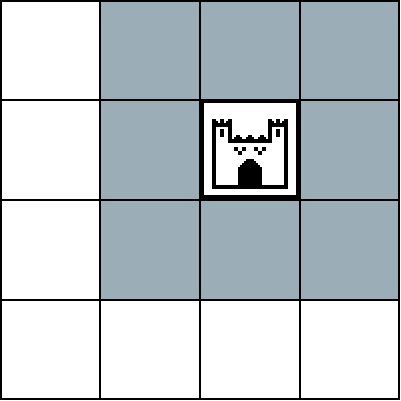
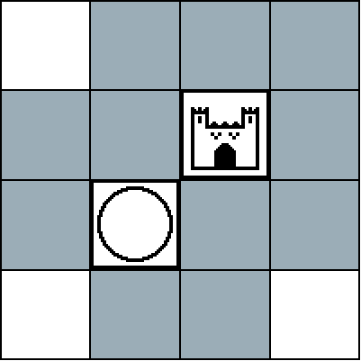
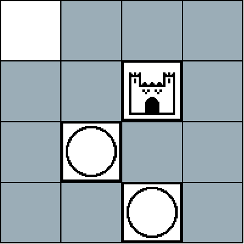

# game-jan-2017
January 2017: Combat Castles

# Combat Castles
A strategy game for 2 players

## Materials
- 1 game board (4x4 grid)
- 10 unit pieces, 5 of one color, and 5 of another color. These pieces must be double-faced (each of the two sides of a unit piece is unique).
- 2 castle pieces, preferably matching each of the unit piece colors
- 5 point tokens

There is a print-and-play version [here](printout.odt). If you'd like to use different items instead, that's fine too! The playtest version of this game used checkers for units, chess rooks for castles, and glass beads for point tokens.

## Definitions
- **castle**: your primary piece, a mobile castle that travels around the board
- **unit**: the pieces that form your castle's army, defending it and attacking your opponent
- **supply**: the current group of units that you may place on the board
- **scrap heap**: the pile of units that have been destroyed, or haven't been sent to supply yet

## Game Objective
Be the first player to score three points. The game immediately ends when a player scores their third point.

## Setup
1. Determine which player will go first.
2. Place the castles at opposite diagonal corners of the board.
3. Place each player's units in separate piles off to the sides of the board. These are your scrap heaps; when units are destroyed, they are placed here.
4. Determine which side of the units indicates that they have moved. When units are placed, they must be placed with the other side face-up.
5. The player who will go second must place one of their units in any of the 3 adjacent spaces to their castle.

## During the game
The players take alternating turns moving their castle, moving and placing units, destroying enemy units, and scoring points by attacking the enemy castle.

## Turn Progression
On a player's turn:

1. The player must take 1 and only 1 unit from their scrap heap and add it to their supply (if there are any units in their scrap heap).
2. The player must move their castle exactly one space in any direction.
  - If the player moves their castle onto a space occupied by an enemy unit, that unit is placed back in the enemy's scrap heap and the enemy takes one of the point tokens.
  - If the player moves their castle onto a space occupied by a friendly unit, that unit is placed back in the player's supply.
  - The player cannot move their castle into the space occupied by the enemy's castle.
3. The player may move one or more of their units that are on the board.
  - A unit may move 1 and only 1 space into an adjacent space.
  - Units may not move into spaces occupied by other friendly pieces.
  - If a unit moves into a square occupied by the enemy castle, then that unit is placed in your scrap heap and you score one point.
  - If a unit has moved and is still on the board, flip it over to indicate that it has moved.
4. The player may place one or more units from their supply onto the board
  - A unit may only be placed in a space adjacent to the player's castle, or adjacent to a unit that can be connected to the player's castle by one or more adjacent units.
5. The player must flip over all of their pieces on the board to their starting side. This ends their turn.

Example of piece placement:

